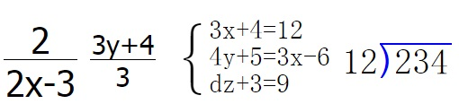

###分数、方程组、除法竖式显示组件

###浙江省新昌县城西小学 唐明 QQ：147885198

这是一个公式转换插件，它使用javascript编写，它可以把分数、方程组、除法这三种标签进行转换，转换为用户所熟悉的样式。而我们编写又非常简便。

要注意的是，在具体使用时，很多编辑器会过滤HTML标签，请把这三种标签加入不过虑列表。否则本插件将不能工作 。

它并不完美，如不支持带分数，不支持其它替换方式，等等还有很多，但它足够简单，只需要2步，您就可以在您的网站加入这些功能，第一步：下载formula.js文件。第二步：在您需要使用的地方加上:

```
<frac fontsize='40'>2/2x-3</frac>
<frac fontsize='30'>3y+4/3</frac>
<equation fontsize='20'>3x+4=12,4y+5=3x-6,dz+3=9</equation>
<division fontsize='30'>234/12</division>
<script>
	var formula=new Formula();
	formula.processAll();
</script>

```

###这些标签将转换为如下的格式：

